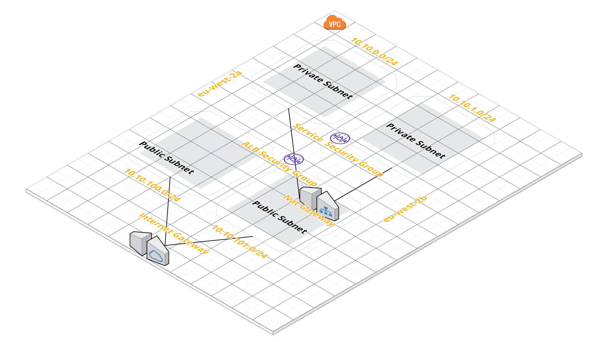
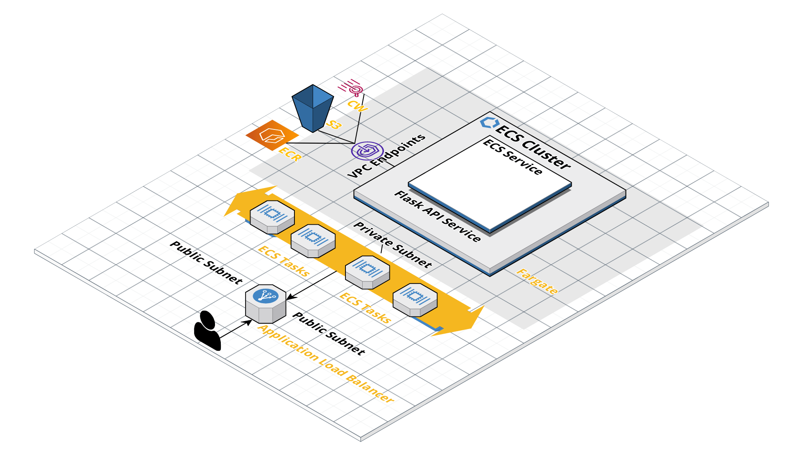
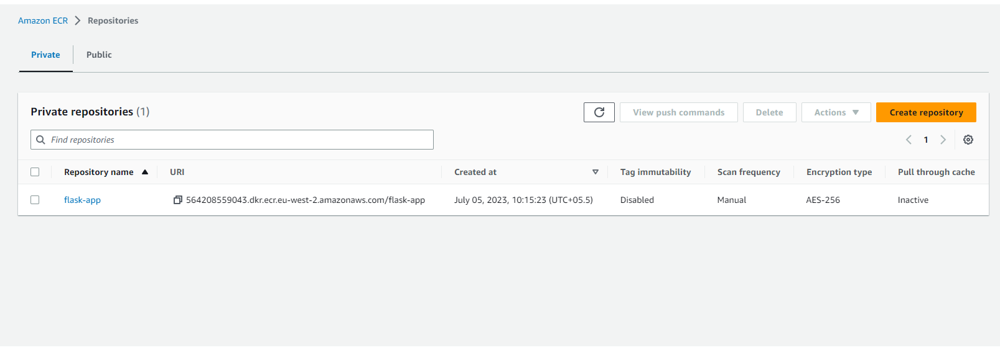
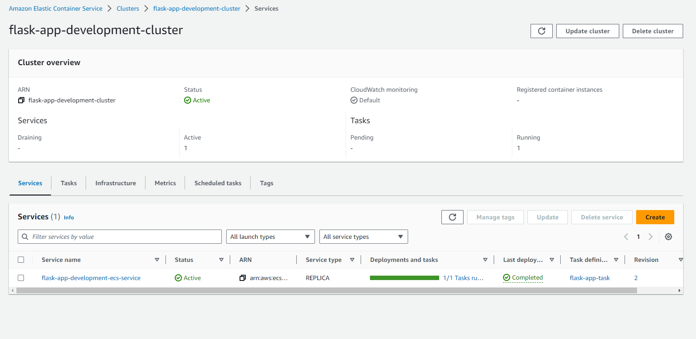
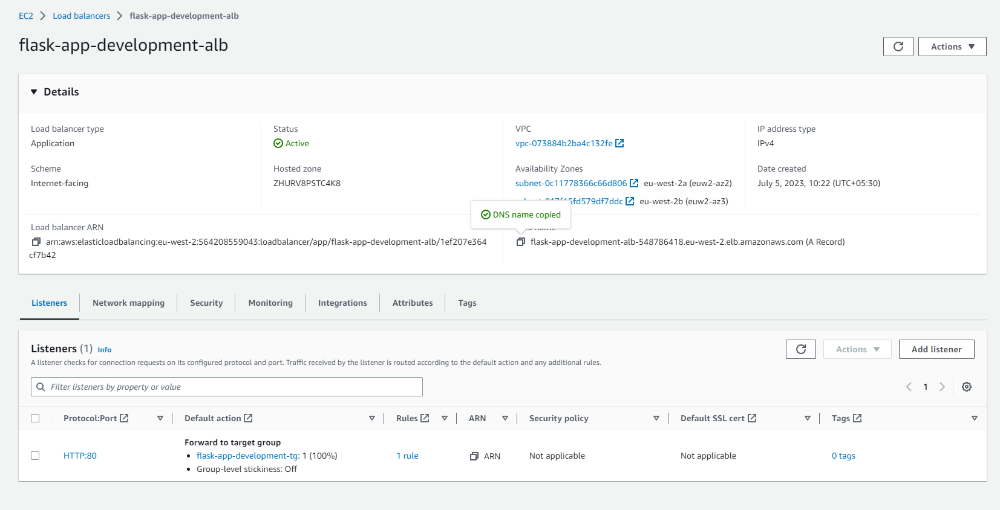
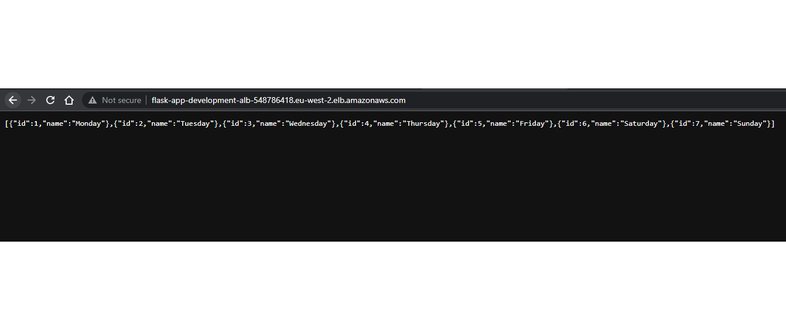
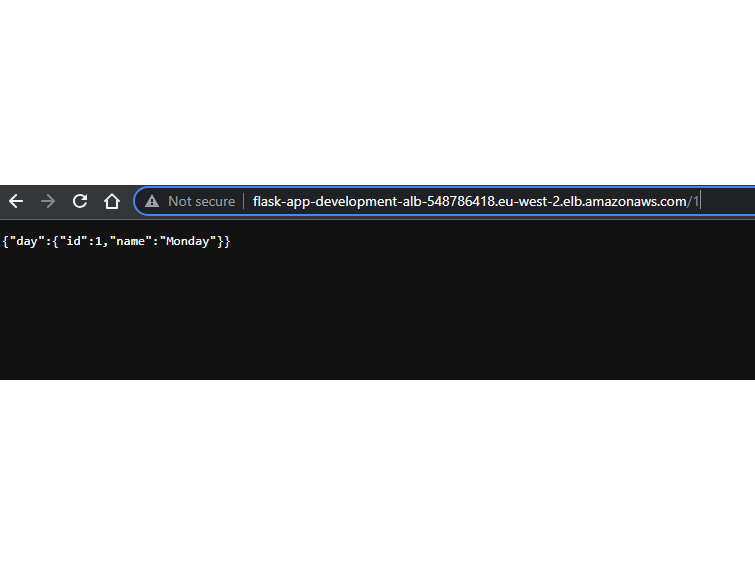

# AWS ECS and Containers Automation with Terraform and Shell Script

This repository contains a solution for automating the deployment of ECS clusters and containers on AWS using Terraform and Shell scripts. It simplifies the process of provisioning the necessary infrastructure and managing containerized applications on the Amazon Elastic Container Service (ECS). The solution leverages Terraform to create AWS resources, such as VPC, IAM, ECR, ECS, and uses Shell scripts to streamline the build and deployment workflows.

## Prerequisites

Before getting started, ensure that you have the following prerequisites installed on your local machine:

- Terraform: [Install Terraform](https://www.terraform.io/downloads.html)
- AWS CLI: [Install AWS CLI](https://aws.amazon.com/cli/)

## Repository Structure

The repository is organized as follows:

```
├───python-api
└───terraform
    ├───ecr
    │   └───.terraform
    │       ├───modules
    │       └───providers
    │           
    ├───modules
    │   ├───ecr
    │   ├───ecs
    │   ├───iam
    │   └───vpc
    └───stack
            ├───modules
            └───providers

```
- `python-api`: Directory contains build_and_push.sh file
- `trerraform/`: This directory contains All Terraform files and modules for creating AWS resources.
- `ecr`: separate entity to create ECR repo to avoid blockers.
- `stack`: This is the heart of this project and contains all ECS and its dependencies modules.
- `outputs.tf`: The file where output values from the Terraform modules are defined.

## Usage

To utilize this solution, follow these steps:

1. Clone the repository to your local machine.
2. Navigate to the repository directory.

### Step 1: Create ECR Repository

3. Execute the `terraform/ecr` terraform script located in the `terraform/` directory by using the command `terraform init; terraform apply --auto-approve` in directory `terraform/ecr`. This script creates an ECR repository to store your container images.

### Step 2: Build and Push Container Images

4. Execute the `build_and_push.sh` script located in the `python-api/` directory. This script builds the container images, performs health checks to ensure container readiness, and pushes the images to the ECR repository.

```bash
./python-api/build_and_push.sh
```

### Step 3: Deploy Infrastructure

5. Execute the `terraform/stack` bundle of scripts located in the `terraform/stack` directory using the command `terraform init; terraform apply --auto-approve`. This script runs the Terraform stack to deploy the required infrastructure.


**Note:** Before running the Terraform commands, make sure you have valid AWS credentials configured using the AWS CLI and user should have access to provisiong and configure ECR, ECS, CloudWatch, ALB, VPC, Endpoints and IAM roles provisioning acecss.

### Architecture design breakdown in system-wise InfraStack and ECS Application Stacks

- AWS VPC Design

- AWS ECS Application Design



### Post deployment Facts and Results.
- ECR Repo

- ECS Cluster

- ALB

- URL oputput

- URL and Query


